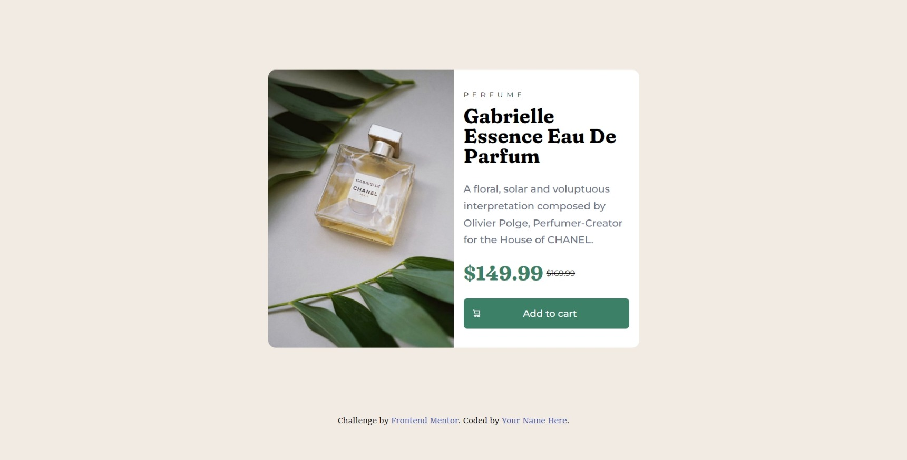

# Frontend Mentor - Product preview card component solution

This is a solution to the [Product preview card component challenge on Frontend Mentor](https://www.frontendmentor.io/challenges/product-preview-card-component-GO7UmttRfa). Frontend Mentor challenges help you improve your coding skills by building realistic projects. 

## Table of contents

- [Overview](#overview)
  - [The challenge](#the-challenge)
  - [Screenshot](#screenshot)
  - [Links](#links)
- [My process](#my-process)
  - [Built with](#built-with)
  - [What I learned](#what-i-learned)
  - [Continued development](#continued-development)
- [Author](#author)

## Overview

### The challenge

Users should be able to:

- View the optimal layout depending on their device's screen size
- See hover and focus states for interactive elements

### Screenshot

### Links

- Solution URL: [Github repo link] (https://github.com/Teezee86/product-preview-card-component-main)
- Live Site URL: [Live URL](https://teezee86.github.io/product-preview-card-component-main/)

## My process

### Built with

- Semantic HTML5 markup
- Flexbox
- Mobile-first workflow

### What I learned

This project was a bit dificult for me.  I enjoyed learning how to change the layout of the screen with media quearies and making it responsive. I believe i accomplished this.
To see how you can add code snippets, see below:

### Continued development

-continue to learn about accessibility
-continue to work on responsive design with mobile first.
-learning how to organize my css and when to use comments 

## Author

- Frontend Mentor - [@Teezee86](https://www.frontendmentor.io/profile/Teezee86)
